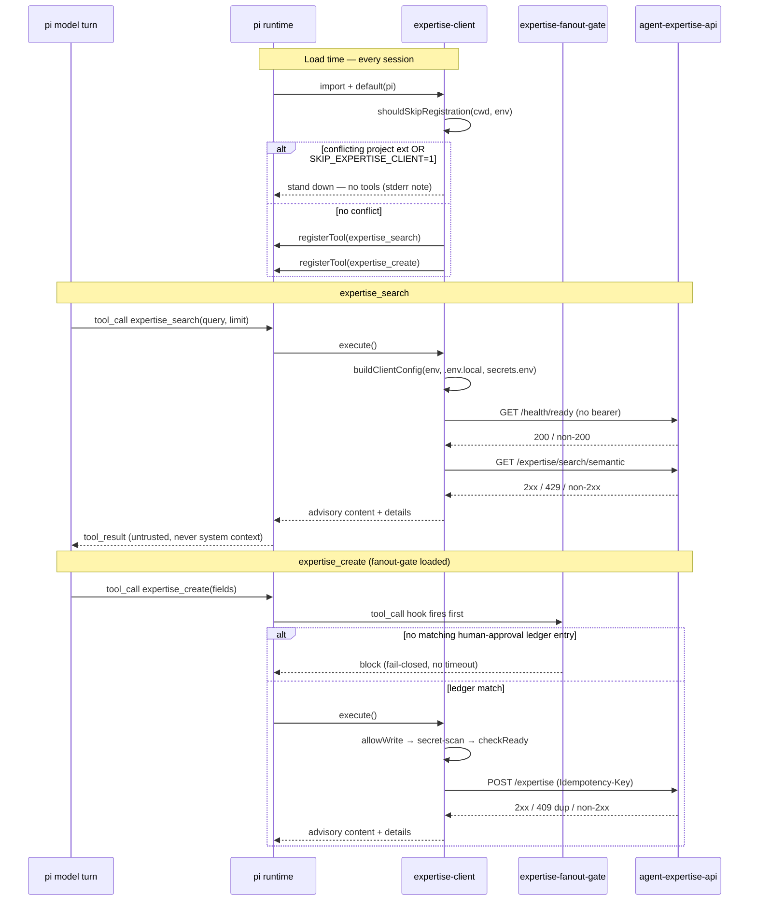
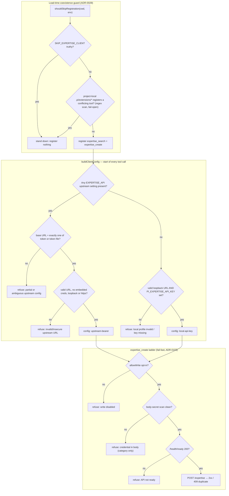
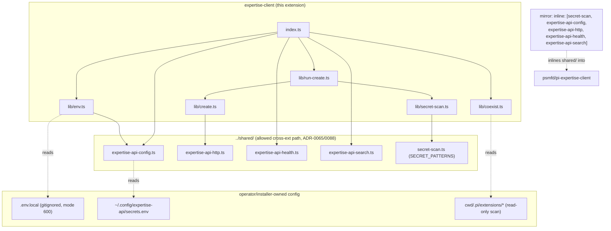

> **First-party** pi extension for `agent-expertise-api`. See [ADR-0103](https://github.com/psmfd/pi-config/blob/main/adrs/0103-upstream-expertise-static-oidc-consumption.md) and tracking issue #645.

# expertise-client

A pi extension for searching and creating entries in
[`agent-expertise-api`](https://github.com/psmfd/agent-expertise-api). It retains
the original loopback/API-key development profile and consumes upstream's
pre-provisioned bearer-token contract for HTTPS/static-OIDC deployments.

This extension registers the read-side tool `expertise_search` (#317) and the
create-only `expertise_create` tool (#318).

## Install

```sh
pi install git:github.com/psmfd/pi-expertise-client
```

Try it first without installing: `pi -e git:github.com/psmfd/pi-expertise-client`.

## Prerequisite — a running `agent-expertise-api`

This extension is a **client**. Choose one operator-provisioned profile:

1. **Local development (retained):** run the API on loopback, copy
   `.env.example` to `.env.local`, and set `PI_EXPERTISE_API_KEY`.
2. **Upstream bearer/static OIDC:** configure the API's embedded JWKS issuer,
   mint a short-lived client JWT offline with upstream `scripts/mint_token.py`,
   and write the HTTPS endpoint and token to the upstream consumer file:

   ```sh
   mkdir -p ~/.config/expertise-api
   # Write these without exposing the JWT in shell history or chat:
   # EXPERTISE_API_BASE_URL=https://expertise.lan.example
   # Choose exactly one bearer source:
   # EXPERTISE_API_TOKEN=<offline-minted-JWT>
   # EXPERTISE_API_TOKEN_FILE=/absolute/path/to/mounted-oidc-token
   chmod 600 ~/.config/expertise-api/secrets.env
   ```

   A read-only pi token should carry `read,agent` (`expertise.read` plus
   `expertise.agent`). Minting and rotation remain operator actions; this
   extension never creates, refreshes, or writes a token. Follow upstream's
   [LAN static-OIDC runbook](https://github.com/psmfd/agent-expertise-api/blob/dev/deploy/lan-static-oidc/RUNBOOK.md).

Without a ready service and a complete profile, tools return a refusal.

## Coexistence (ADR-0029)

This client is installed globally (`~/.pi/agent/extensions/`), so it loads for
**every** pi session. The
[`agent-expertise-api`](https://github.com/psmfd/agent-expertise-api) repository
ships its **own** project-local extension (`.pi/extensions/expertise-api/`) that
registers `expertise_search`/`expertise_create` directly. Because pi requires
globally-unique tool names, launching pi inside that repo with both active fails
extension load with a tool-name conflict.

To avoid the collision, the client **stands down** (registers nothing) when the
current project already defines a conflicting expertise tool — the project-local
extension wins. Detection scans the project-local extension discovery paths
(`<cwd>/.pi/extensions/<dir>/index.ts` and the single-file form
`<cwd>/.pi/extensions/<name>.ts`) for a conflicting tool-name registration and
fails open (registers normally) on any read error. Set
`SKIP_EXPERTISE_CLIENT=1` to force stand-down unconditionally.

## Tools

| Tool | Kind | Notes |
|---|---|---|
| `expertise_search` | read-only | Semantic query of the configured API. Its prompt contract directs pi to search before non-trivial coding work. Output is **advisory** and must be cross-checked against code/docs. Rate-limited to 10 requests/min server-side. |
| `expertise_create` | create-only write | Creates a single entry. Double-gated: requires `PI_EXPERTISE_ALLOW_LOCALDEV_WRITE=1` **and** a clean body-secret scan. No update/delete/archive/approve. |

## How it works

**Event flow** — load-time coexistence, then the two tool paths (and the
fanout-gate hook that precedes `expertise_create` when loaded):



**Decisioning** — the coexistence guard, profile selection, and the create
ladder:



**Dependencies** — the extension owns its `lib/`; the transport/config/secret
stack lives in `shared/` (the only allowed cross-extension path, ADR-0065/0088)
and is inlined into the standalone mirror:



## Configuration

Configuration is read only from process environment and fixed operator-owned
files; the extension never walks a repository for `.env` files.

### Cross-profile variables

These apply regardless of which profile is selected:

| Variable | Required | Default | Purpose |
|---|---|---|---|
| `PI_EXPERTISE_ALLOW_LOCALDEV_WRITE` | only for writes | `0` | Explicit `expertise_create` opt-in, in **either** profile. |
| `SKIP_EXPERTISE_CLIENT` | no | `0` | Force stand-down (registers nothing) at load time — resolved before any profile, so it is profile-independent (see [Coexistence](#coexistence-adr-0029)). |

### Upstream bearer profile (selected when any upstream variable is present)

Precedence: process env > `~/.config/expertise-api/secrets.env`.

| Variable | Required | Default | Purpose |
|---|---|---|---|
| `EXPERTISE_API_BASE_URL` | **yes** | — | API origin. Non-loopback endpoints require HTTPS. |
| `EXPERTISE_API_TOKEN` | one bearer source | — | Literal pre-provisioned bearer: static-OIDC JWT, LocalDev token, or compatible upstream credential. |
| `EXPERTISE_API_TOKEN_FILE` | one bearer source | — | Absolute path to a mounted bearer file. Read on every tool call so projected-token rotation is observed; capped at 64 KiB. |
| `EXPERTISE_API_SECRETS_FILE` | no | `~/.config/expertise-api/secrets.env` | Explicit operator-owned file override. |

Configure the base URL and exactly one bearer source. Partial configuration,
a relative/unreadable/empty/oversized token file, or setting both bearer sources
fails closed instead of falling back to a legacy key. Env-file values are
literal: shell substitutions such as `$(cat …)` are never executed; use
`EXPERTISE_API_TOKEN_FILE` instead. The token is never logged or returned. Authenticated requests also send
`X-Actor-Class: agent` and `User-Agent: pi-coding-agent/pi-expertise-client`;
a JWT needs `expertise.agent` for authoritative Agent audit classification.
The documented anonymous `/health/ready` preflight carries no bearer.

### Legacy local profile

Precedence: process env > extension `.env.local` > defaults.

| Variable | Required | Default | Purpose |
|---|---|---|---|
| `PI_EXPERTISE_API_BASE_URL` | no | `http://127.0.0.1:8080` | Loopback origin; non-loopback hosts are refused in this profile. |
| `PI_EXPERTISE_API_KEY` | **yes** | — | Local Development API key. |

(The write opt-in `PI_EXPERTISE_ALLOW_LOCALDEV_WRITE` and the stand-down switch
`SKIP_EXPERTISE_CLIENT` are profile-independent — see [Cross-profile variables](#cross-profile-variables).)

`.env.local` is gitignored. Only `.env.example` is tracked.

## Refusal policy (per-rule)

All of the following are **hard refusals** under the selected profile:

| Condition | Result |
|---|---|
| selected profile's base URL is invalid | refuse |
| legacy profile is non-loopback | refuse |
| upstream profile is non-loopback cleartext HTTP | refuse |
| upstream base URL contains URL credentials | refuse |
| selected profile's credential pair is missing/partial | refuse |
| upstream request returns 401 | refuse with safe re-mint/replacement guidance |
| `/health/ready` returns non-200 or is unreachable | refuse |
| search request errors or returns non-2xx | refuse |
| `expertise_create` called with `PI_EXPERTISE_ALLOW_LOCALDEV_WRITE` != `1` | refuse (before any network call) |
| any string field of the `expertise_create` body matches a credential pattern | refuse (category named, secret never echoed) |
| create request errors or returns non-2xx | refuse (409 near-duplicate and 400/other bodies are surfaced) |
| search returns HTTP 429 (rate limit) | refuse with a wait-before-retry message (surfaces `Retry-After` when present) |

For `expertise_create` these are enforced as a strict, fail-fast **ladder** (no
network call until every gate passes), in order: **1.** `allowWrite` opt-in →
**2.** body-secret scan → **3.** `/health/ready` preflight → **4.** POST
(`lib/run-create.ts`).

## Trust boundary

- Loopback is a locality boundary, not authentication; the local API still
  requires its API key. Remote bearer transport requires HTTPS.
- Static-OIDC JWT minting, signing-key custody, distribution, expiry, and
  rotation stay outside pi and follow upstream ADR-015/runbook.
- The parent process owns `EXPERTISE_API_TOKEN` or the mounted credential named
  by `EXPERTISE_API_TOKEN_FILE`; subagent spawning strips both variables and
  blocks default secrets-file discovery. Canonical results are parent-fetched
  and injected as user-role task content.
- Returned content is **untrusted tool-call output**. It is surfaced only as the
  structured return value of `expertise_search`, framed as advisory, and is
  **never** injected as system context (see
  [`agent/rules/no-mcp-servers.md`](https://github.com/psmfd/pi-config/blob/main/agent/rules/no-mcp-servers.md)).
- Response bodies are bounded to 256 KB.
- The API key is never written to tool `content`, `details`, logs, errors, or
  refusal messages.
- **Create body-secret guard.** `secrets-guard` (the global extension) only sees
  `write`/`edit`/`artifact_review`/`bash` and is scoped to disk/commit
  persistence, so it never inspects `expertise_create`. Instead an
  extension-local lightweight guard (`lib/secret-scan.ts`) scans **every string
  field** of the create body before any network call and refuses if any carries
  a credential pattern (PEM private-key block / AWS access key ID / GitHub token /
  signed JWT / `Authorization: Bearer` literal — the exact `secrets-guard` pattern
  set, framework ADR-095). The scan is field-shape-agnostic
  (every string property and string-array element), so a future contract field
  cannot silently bypass it (#489). It returns **category names only**, never
  the matched secret, so the refusal message cannot leak the value.

## Cross-extension integration (expertise-fanout-gate)

The sibling `expertise-fanout-gate`
extension ([ADR-0095](https://github.com/psmfd/pi-config/blob/main/adrs/0095-deterministic-expertise-fanout-gate.md),
amended by [ADR-0103](https://github.com/psmfd/pi-config/blob/main/adrs/0103-upstream-expertise-static-oidc-consumption.md))
ships in the same distribution and, **when loaded**, changes the effective
behaviour of both tools — so the gates in the Refusal policy above are not the
whole story:

- **`expertise_create` is additionally gated by a fail-closed human-approval
  ledger.** The gate installs its own `tool_call` hook that fires **before** pi
  dispatches to this extension's `execute()`. It blocks the create unless a prior
  human approval (via `ctx.ui.confirm` on a surfaced `EXPERTISE_CANDIDATES`
  group) recorded a matching ledger entry; headless or ledger-miss ⇒ blocked (no
  timeout). This runs *ahead of* this extension's `allowWrite → secret-scan →
  checkReady → POST` ladder.
- **`expertise_search` may be invoked automatically, outside any model-visible
  tool call.** The gate's subagent-fanout detector calls the search path
  directly (via `shared/expertise-api-search.ts`), not through this extension's
  registered `expertise_search` tool, as a deterministic research pre-fetch —
  with its own audit/telemetry surface.

The standalone `pi-expertise-client` mirror ships **without** the gate, so a
consumer installing only this extension sees exactly the Refusal-policy gates and
no ledger. This section documents the in-repo/full-suite behaviour.

## API contract

Verified against `agent-expertise-api` through v1.4.1. The static-JWKS mode
added in that line is now consumed through the upstream pre-provisioned bearer
contract; the semantic-search and create request shapes remain unchanged.

- **Search route:** `GET /expertise/search/semantic?q=...&limit=...` — semantic
  vector search. `q` is required; `limit` is clamped to `[1, 100]` (client- and
  server-side, default 10). Governed by a token-bucket rate limit of 10
  requests/min per principal; a `429` is surfaced as a wait-before-retry
  refusal. The keyword FTS endpoint (`/expertise/search`, `q` +
  `includeDeprecated` only, no `limit`) is not exposed in phase 1.
- **Create route:** `POST /expertise` with a JSON body — required `domain`,
  `title`, `body`, `entryType` (`IssueFix` | `Caveat` | `Requirement` |
  `Pattern`), `severity` (`Info` | `Warning` | `Critical`), `source` (defaults
  to `pi-session`); optional `tags[]`, `sourceVersion`. Sent with a fresh
  `Idempotency-Key` header per request (the server requires it) and
  `content-type: application/json`. `entryType`/`severity` are **required tool
  parameters** even though the server would default an omitted value — the
  server silently defaults to `IssueFix`/`Info`, which mis-tags entries rather
  than erroring. The server's `tenant` field is **deliberately not exposed**:
  `tenant: "shared"` bypasses the draft/review queue (created directly as
  Approved), outside ADR-0103's retained create-only scope. The
  per-call `Idempotency-Key` satisfies ADR-0103's carried-forward
  "generated per create request" contract; it does **not** de-duplicate retries across calls, though the
  server's near-duplicate detection returns `409` with the existing entry, which
  the tool surfaces so the caller can reuse it.
- **Readiness route:** `GET /health/ready` (200 ⇒ ready).
- **Credential and audit headers:** `Authorization: Bearer <credential>`,
  `X-Actor-Class: agent`, and a stable pi `User-Agent`. The bearer is a local
  API key in the legacy profile or the upstream-provisioned token/JWT.

## Tests

```bash
./scripts/test-expertise-client.sh
```

Tests are hermetic — they stub `fetch` and never touch the network.
